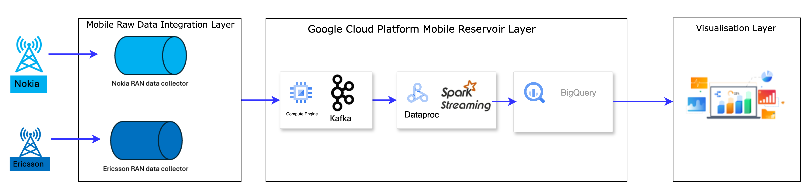

# Team Plutus Project - Realtime Insights for Mobility and Safety


## 📋 Table of Contents
- [Introduction](#introduction)
- [Motivation and Significance](#MotivationandSignificance)
- [Installation](#installation)
- [Usage](#usage)
- [Configuration](#configuration)
- [Contributing](#contributing)
- [License](#license)
- [Acknowledgments](#acknowledgments)

## 📝 Introduction
This project addresses the challenge of analysing and deriving real-time insights from large volumes of Radio Access Network (RAN) data generated by mobile networks. RAN data includes crucial information related to user device connections, base station performance, and traffic patterns, which can offer valuable insights for urban mobility and safety management. However, due to the sheer scale, velocity, and complexity of the data, it remains largely underutilized in real-time applications. The goal is to design a scalable, real-time data engineering framework that converts batch processing into streaming, enabling the processing and analysis of RAN data in real-time. This will provide actionable insights for managing foot traffic, crowd dynamics, and urban congestion, particularly in high-density areas or during critical events.

## ✨ Motivation and Significance
With increasing reliance on mobile networks in urban planning, transportation, and emergency response, RAN data presents unique opportunities to understand and manage the flow of people, especially during high-density events like natural disasters, large gatherings, or urban congestion. Leveraging real-time RAN data can improve decision-making in public transportation, urban planning, and safety management by providing timely insights into foot traffic and population density.

## 🛠️ Design Goals and Feature
The project aims to create a scalable, efficient system capable of processing and analysing real-time RAN data. Key features of the system include:
- Real-Time Data Ingestion: The system will handle continuous, high-volume streams of RAN data using technologies like Apache Kafka, ensuring seamless, real-time data ingestion without delays.
- Scalable Data Processing: To accommodate the growing volume of RAN data, the system will use distributed computing frameworks like Apache Spark, which can process data both in real-time and in batch modes. This will allow for large-scale data processing while maintaining performance and flexibility.
- Dynamic Data Storage: Big Query, a serverless and scalable database, will be used to store and retrieve vast amounts of RAN data. This will ensure quick access to data for analysis, even with high-frequency data input.
- Visualization: Real-time dashboards and heat maps will provide visual insights into mobility patterns and safety metrics, allowing decision-makers to act quickly based on the current data.


## Scalability and Performance Goals
To ensure the system can process large data volumes in real-time, scalability and performance are essential. The following goals will be prioritized:
- Data Latency: Ensuring quick processing and analysis of incoming data within a specified time frame to enable timely decision-making.
- Throughput: Handling high volumes of RAN events per minute, especially during peak times, without compromising performance.
- Elastic Scalability: Using Apache Kafka and Apache Spark for horizontal scalability to accommodate increasing data loads.
- Efficient Visualization: Rendering real-time visualizations, such as heat maps and dashboards, without delays, ensuring quick insights and actions.

## Data Processing Layer

- Data Ingestion Layer: Responsible for continuously streaming RAN data from telecommunications networks using Apache Kafka. Kafka ensures high throughput and low latency, enabling real-time data ingestion from mobile networks. The data includes fields such as device_id, timezone_visit, lat_visit, lon_visit, time_stamp, etc.
- Processing Layer: Powered by Apache Spark, the processing layer handles both real-time stream processing and batch analytics of historical data. Spark’s distributed architecture allows for efficient processing of large datasets, ensuring quick insights during critical events.
- Storage Layer: Big Query is used to store and query high-velocity data, offering flexibility in data schema and fast query execution. The storage layer allows for both real-time and historical data storage, enabling analytics at scale.
- Visualization and Actionable Insights: Folium is used to generate interactive geospatial maps, and Streamlit provides real-time dashboards to visualize mobility patterns, foot traffic, and safety alerts. These tools enable decision-makers to quickly respond to trends and anomalies..



The synthetic data has been produced by using cloud function.

# Mobility Data Kafka Publisher Cloud Function

This repository contains a Google Cloud Function that generates synthetic mobility footfall data and sends it to a Kafka topic. 
The provided code defines a cloud function to generate and push sample mobility footfall data to Kafka. It starts by importing necessary libraries like pandas, random, datetime, and kafka.

The core functionality revolves around generating mock mobility data, including device IDs, visit times, locations (latitude and longitude), and associated timestamps. The generate_sample_data function creates a DataFrame with randomly generated values for these fields, simulating visitor data for a specified location and a given number of records.

The create_kafka_producer function sets up a Kafka producer configured to send data to a Kafka server located at a specified address. The push_data_to_kafka function iterates over the DataFrame and sends each row as a message to a Kafka topic ("visit-data-topic").

The location_data_gen function is an HTTP-triggered cloud function that processes incoming requests. It expects JSON input containing latitude, longitude, and the number of records to generate. It validates the input, generates the sample data, and pushes it to Kafka. If any errors occur (e.g., missing or invalid parameters), appropriate error messages are returned.

Overall, the code simulates location-based visit data and sends it to a Kafka topic for further processing or analysis.

## The Cloud Function:

Generates random sample records representing footfall data, including fields like latitude, longitude, and visit time.

Connects to a Kafka broker and pushes the generated records to a specified Kafka topic.

Can be configured with different numbers of records and Kafka topics through HTTP request parameters.

# Prerequisites

To deploy and run this Cloud Function, ensure you have:

### Google Cloud SDK: 
Install and configure the Google Cloud SDK to manage your Google Cloud resources.

### Kafka Broker: 
A running Kafka server that the Cloud Function can access. Modify bootstrap_servers with the correct Kafka server address.

### Python Libraries:
Install required Python packages:
 - pip install pandas kafka-python functions-framework

### Google Cloud Project: 
A Google Cloud project with permissions to deploy Cloud Functions.

# Code Explanation

## Main Components

### Data Generation:
The location_data_gen function creates a DataFrame with synthetic footfall data, including:
- device_id: Simulated device identifiers.
- timezone_visit
- day_of_week_visit
- time_stamp
- lat_visit
- lon_visit
- data_visit
- time_visit

Various fields representing the location, timestamp, and visit details for each record.
By default, it generates 100 records, though this can be adjusted.

Sample HTTPS calls to generate random test records example :- 

````
curl -m 70 -X POST https://us-east1-team-plutus-iisc.cloudfunctions.net/location-data-gen \
-H "Authorization: bearer $(gcloud auth print-identity-token)" \
-H "Content-Type: application/json" \
-d '{
  "lat": "53.5500",
  "lon": "-2.4333",
  "num_records": "500"
}'
````

Example output :
````
{"device_id": "+447652281079", "timezone_visit": "UTC+0", "day_of_week_visit": "Friday", "time_stamp": 1731655224.390121, "lat_visit": 53.549933, "data_visit": "2024-11-29", "time_visit": "04:08:15", "lon_visit": -2.433338}
{"device_id": "+447774158921", "timezone_visit": "UTC+0", "day_of_week_visit": "Thursday", "time_stamp": 1731482424.390124, "lat_visit": 53.549947, "data_visit": "2024-11-03", "time_visit": "07:59:04", "lon_visit": -2.433206}
````

### Kafka Producer Setup:
create_kafka_producer initializes a Kafka producer with JSON serialization to communicate with the Kafka server.

### Pushing Data to Kafka:
The push_data_to_kafka function iterates over each row in the DataFrame, converting it to a dictionary and sending it as a message to the specified Kafka topic.

### Cloud Function HTTP Trigger:
The location_data_gen function is the entry point for this Cloud Function. It accepts an HTTP request with two optional parameters:

### topic: 
Kafka topic to which the data will be sent (default is 'visit-data-topic').

## Code Steps

### Generate Data:
The function generates synthetic mobility data using location_data_gen.

### Create Kafka Producer:
A Kafka producer is created with create_kafka_producer to send data to the Kafka topic.

### Push Data to Kafka:
Each row in the generated data is sent to Kafka using push_data_to_kafka.

### Return Status:
A success message is returned upon completing the data push.

# Kafka to BigQuery Streaming Pipeline
This project contains a Spark application designed to run on a Google Dataproc cluster.
It reads streaming data from a Kafka topic, processes it using Apache Spark, and applies KMeans clustering to geographical data (latitude and longitude). The process begins by setting up a Spark session and defining the schema for Kafka messages. It then parses the messages, hashes the device_id, converts timestamps into a human-readable format, and filters valid latitude and longitude values. The VectorAssembler is used to prepare the data for clustering, and the optimal number of clusters is determined using the Elbow Method. Finally, the clustered data is written to BigQuery using a micro-batch approach.

# Overview
This pipeline enables real-time data ingestion from Kafka and stores processed data in BigQuery, providing a scalable solution for handling streaming data on Google Cloud.

# Prerequisites

To successfully deploy and run this pipeline, ensure the following prerequisites are met:

## 1. Google Cloud Project
A Google Cloud project with billing enabled.
Necessary permissions to create resources in BigQuery and Google Cloud Storage.

## 2. Google Dataproc Cluster
A Dataproc cluster with Spark installed.
Configure the cluster to include the following Spark packages:
org.apache.spark:spark-sql-kafka-0-10_2.12:3.2.1
org.apache.kafka:kafka-clients:3.8.0

## 3. Kafka Setup
A running Kafka cluster with a configured topic for streaming data.
Kafka topic and bootstrap server details.

## 4. BigQuery and Google Cloud Storage
A BigQuery dataset and table (projectid.dataset.tablename) to store processed data.
A Google Cloud Storage bucket for temporary data staging during BigQuery writes.

## 5. Google Cloud SDK
Ensure gcloud CLI is installed and authenticated with the necessary permissions.

## 6. Python Dependencies
pyspark installed in your environment (if running locally for testing).

# Pipeline Workflow
## 1. Spark Session Initialization
Configures Spark with the necessary dependencies for both Kafka and BigQuery integration. This session runs under the team-plutus Google Cloud project.
## 2. Kafka Configuration
The application connects to a specified Kafka server and subscribes to a topic:

kafka.bootstrap.servers: Kafka server address
subscribe: Kafka topic
auto.offset.reset: Manages data offset (set to earliest for initial load)

## 3. Message Schema
Defines a schema for Kafka messages in JSON format with fields like:

- device_id
- timezone_visit
- day_of_week_visit
- lat_visit
- lon_visit
- timestamp

Example records in Kafka:
````
{"device_id": "+447652281079", "timezone_visit": "UTC+0", "day_of_week_visit": "Friday", "time_stamp": 1731655224.390121, "lat_visit": 53.549933, "data_visit": "2024-11-29", "time_visit": "04:08:15", "lon_visit": -2.433338}
{"device_id": "+447774158921", "timezone_visit": "UTC+0", "day_of_week_visit": "Thursday", "time_stamp": 1731482424.390124, "lat_visit": 53.549947, "data_visit": "2024-11-03", "time_visit": "07:59:04", "lon_visit": -2.433206}
````

## 4. Data Processing

- Reads Kafka messages and parses them according to the defined schema.
   - Extracts individual fields for transformation and storage.
  - **Data Transformation**:
     - Masking `device_id` using SHA-256 hash and a substitution cipher.
     - Converting `time_stamp` from Unix format to datetime format.
     ````
     col("data.device_id").isNotNull(), sha2(col("data.device_id"), 256)).otherwise(None)
    
     from_unixtime(floor(col("data.time_stamp")), "yyyy-MM-dd HH:mm:ss")
     ````

## 5. BigQuery Configuration

Specifies the BigQuery table (projectid.dataset.tablename) as the target
Uses Google Cloud Storage as a temporary bucket for staging data

## 6. Spark ML

Preprocess geographical data (latitude and longitude) by applying KMeans clustering. It dynamically determines the optimal number of clusters using the Elbow Method and stores the results, including device information and visit date, in a BigQuery table for further analysis.

## 1. Vectorization for Clustering:
- The VectorAssembler is used to combine the lat_visit and lon_visit columns into a single feature vector for each record. This is required for clustering algorithms like KMeans, which work on numerical features in vector form.
`````
vector_assembler = VectorAssembler(inputCols=["lat_visit", "lon_visit"], outputCol="features")
vectorized_df = vector_assembler.transform(parsed_df)
`````
The VectorAssembler takes the lat_visit and lon_visit columns as inputs and combines them into a new column features which will be used as the input for the KMeans algorithm.

## 2. Finding the Optimal Number of Clusters (Elbow Method):
- The find_optimal_k function uses the Elbow Method to determine the optimal number of clusters for KMeans. This method evaluates different values of k (number of clusters) and selects the value that minimizes the cost (within-cluster sum of squared errors)

-The function iterates over different values of k (from 2 to max_k) and computes the clustering cost for each value. The optimal number of clusters is the one with the lowest cost, which is then used in the KMeans clustering.

## 3. Applying KMeans on Each Batch:
- The apply_kmeans_on_batch function performs clustering on each batch of data, determining the optimal number of clusters and applying the KMeans algorithm. After clustering, the results are transformed and relevant columns are selected for storage in BigQuery.
- The function first determines the optimal number of clusters (optimal_k) for the batch.
- Then, it applies KMeans clustering to the batch_df using the determined k.
- After clustering, the function selects the relevant columns (device_id, date_visit, lat_visit, lon_visit, and cluster_pred), which include the predicted cluster for each record.
- Finally, the data is written to BigQuery using the write_to_bigquery function.

## 7. Writing to BigQuery

Defines the write_to_bigquery function to handle each micro-batch, appending data to the BigQuery table
Sets a trigger interval of 10 seconds for consistent data streaming

## 8. Stream Execution

The query runs continuously until terminated, ensuring a steady data flow from Kafka to BigQuery

# Usage

Deploy this application to a Dataproc Spark cluster
Set up Kafka with the appropriate topic and configurations
Ensure Google Cloud Storage and BigQuery tables are configured as specified

This setup provides a resilient, scalable streaming data pipeline that leverages Google Cloud's capabilities for real-time analytics.


# Bigquery table schema
```yaml

[
  {
    "name": "device_id",
    "mode": "NULLABLE",
    "type": "STRING",
    "description": "Hashed DeviceId",
    "fields": []
  },
  {
    "name": "lat_visit",
    "mode": "NULLABLE",
    "type": "FLOAT",
    "description": "Latitide",
    "fields": []
  },
  {
    "name": "lon_visit",
    "mode": "NULLABLE",
    "type": "FLOAT",
    "description": "longitude",
    "fields": []
  },
  {
    "name": "date_visit",
    "mode": "NULLABLE",
    "type": "STRING",
    "description": "date time",
    "fields": []
  },
  {
    "name": "cluster_pred",
    "mode": "NULLABLE",
    "type": "INTEGER",
    "description": "clustring predection after the ML model execution",
    "fields": []
  }
]
````

Final output in BQ table example :-


# Emergency services monitoring

This project provides a Streamlit-based web application to visualize live population heatmaps and alert users of potential "red wave" events based on population density data. It integrates Google BigQuery for data querying, H3 indexing for spatial aggregation, and Folium for interactive mapping.

## Key Features
### Data Integration with Google BigQuery:

- Fetches location data (lat_visit, lon_visit, date_visit, cluster_pred) from BigQuery.
- Supports date-based filtering using a custom query.
### H3 Indexing for Geospatial Analysis:

- Converts latitude/longitude into H3 grid cells for spatial aggregation.
A- ggregates pings by H3 grid, hour, and date.
### Statistical Analysis:

- Calculates mean and standard deviation of pings for each location.
- Flags anomalies using a two-standard-deviation threshold.
- Identifies "red wave" events for areas with over 1500 pings in a specific hour.
### Interactive Map:

- Displays aggregated data as markers on a Folium map.
- Differentiates normal activity and red waves using color-coded markers (blue for normal, red for alerts).
### Analytics Dashboard:

- Shows total data points, clusters, pings by hour/date, and cluster distribution in a sidebar.
- Provides statistical insights alongside the map.
### Real-Time Updates:

- Allows users to refresh the map and set custom refresh intervals (5-60 seconds).
- Dynamically fetches and displays updated data.

## How to Use
### Prerequisites:

- Install required Python libraries (streamlit, pandas, folium, h3, google-cloud-bigquery, streamlit-folium).
- Configure Google Cloud BigQuery credentials and replace path-to-service-account-json-key with your JSON key path.

### Run the Application:
`````
streamlit run LivePopulationHeatmap.py
`````

### Customize Inputs:

- Use the sidebar to set a date range for analysis and adjust the refresh interval.
- Monitor the analytics insights and map for "red wave" alerts.
### Visualize Data:

- Explore the interactive map, which highlights locations with high population density using markers.

## Technologies Used
- Frontend: Streamlit for the web interface.
- Backend: Google BigQuery for querying and data storage.
- Visualization: Folium for mapping, H3 for spatial data aggregation.
- Python Libraries: pandas, numpy, time, h3, streamlit-folium.

## Example Outputs
