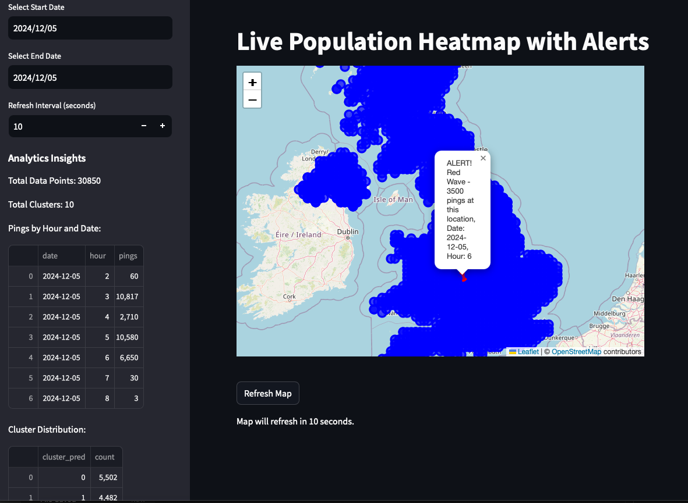

# Emergency services monitoring

This project provides a Streamlit-based web application to visualize live population heatmaps and alert users of potential "red wave" events based on population density data. It integrates Google BigQuery for data querying, H3 indexing for spatial aggregation, and Folium for interactive mapping.

## Key Features
### Data Integration with Google BigQuery:

- Fetches location data (lat_visit, lon_visit, date_visit, cluster_pred) from BigQuery.
- Supports date-based filtering using a custom query.
### H3 Indexing for Geospatial Analysis:

- Converts latitude/longitude into H3 grid cells for spatial aggregation.
A- ggregates pings by H3 grid, hour, and date.
### Statistical Analysis:

- Calculates mean and standard deviation of pings for each location.
- Flags anomalies using a two-standard-deviation threshold.
- Identifies "red wave" events for areas with over 1500 pings in a specific hour.
### Interactive Map:

- Displays aggregated data as markers on a Folium map.
- Differentiates normal activity and red waves using color-coded markers (blue for normal, red for alerts).
### Analytics Dashboard:

- Shows total data points, clusters, pings by hour/date, and cluster distribution in a sidebar.
- Provides statistical insights alongside the map.
### Real-Time Updates:

- Allows users to refresh the map and set custom refresh intervals (5-60 seconds).
- Dynamically fetches and displays updated data.

## How to Use
### Prerequisites:

- Install required Python libraries (streamlit, pandas, folium, h3, google-cloud-bigquery, streamlit-folium).
- Configure Google Cloud BigQuery credentials and replace path-to-service-account-json-key with your JSON key path.

### Run the Application:
`````
streamlit run LivePopulationHeatmap.py
`````

### Customize Inputs:

- Use the sidebar to set a date range for analysis and adjust the refresh interval.
- Monitor the analytics insights and map for "red wave" alerts.
### Visualize Data:

- Explore the interactive map, which highlights locations with high population density using markers.

## Technologies Used
- Frontend: Streamlit for the web interface.
- Backend: Google BigQuery for querying and data storage.
- Visualization: Folium for mapping, H3 for spatial data aggregation.
- Python Libraries: pandas, numpy, time, h3, streamlit-folium.

## Example Outputs
